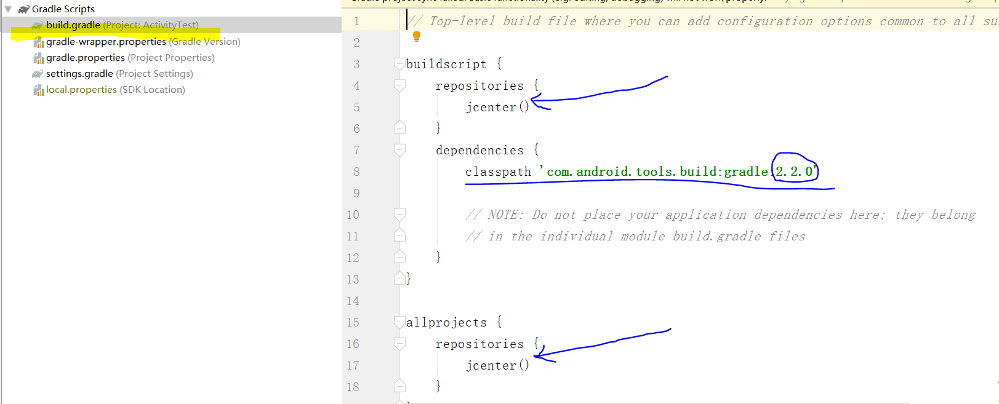
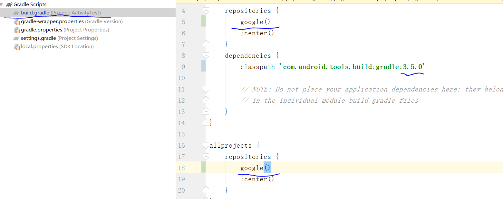
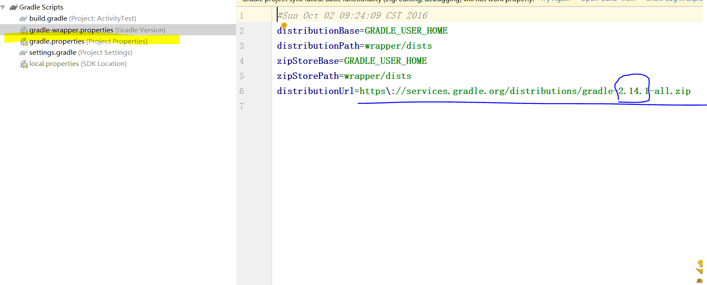
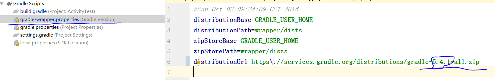

# 2017118126_Android
1.解决载入时版本问题:
  a.修改build.gradle文件的内容
  
  
  
	dependencies {
        classpath 'com.android.tools.build:gradle:3.5.0'
    }
    记得把classpath修改为自己本地的版本,否则会默认从远端下载
    repositories {
        google()
        jcenter()
    }
   
    记得加入google(),否则加载文件会失败
    
   
  b.修改gradle-wrapper.properties文件内容
 
 
 
   distributionUrl=https\://services.gradle.org/distributions/gradle-5.4.1-all.zip
   ![image](导入安卓文件截图/4.改后的gradle-wrapper.properties文件.PNG）
   修改为本地的版本
2.SourceTree推送失败问题:
  原因:远程库和本地库存在差异
  解决方法:a. 通过命令行 git pull origin master
  结果:命令行将会报错
  From https://github.com/Son-Wind/2017118126_Android
  * branch            master     -> FETCH_HEAD
   fatal: refusing to merge unrelated histories

   解决方法:b. 通过命令行:git pull origin master --allow-unrelated-histories
   这时就进行了本地库与远程库的合并.排除差异

   最后在sourceTree点击提交就能完美运行
